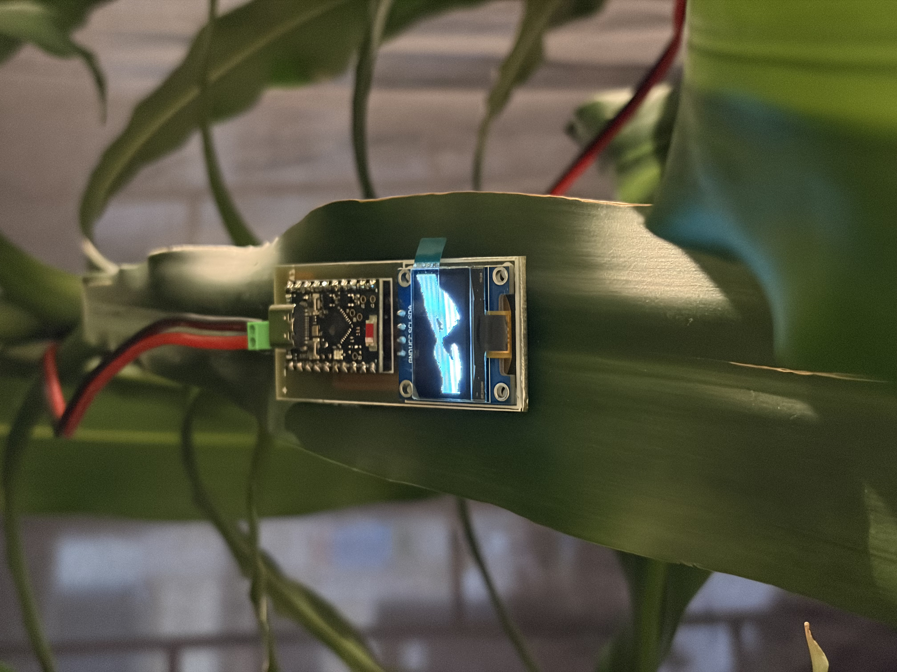

# Sueño con el cielo y el mar

**Renzo Rospigliosi** — Proyecto de grado, Maestría en Artes Plásticas, Electrónicas y del Tiempo, Universidad de los Andes (2022)
<br> Expuesto en Voltaje - Salón de Arte Ciencia y Tecnología (2022) en el Planetario de Bogotá y en Contacto Sintético: Un diálogo entre Lina González y Renzo Rospigliosi (2026) en el Espacio Común de la FaCrea, como parte del circuito de ArtBo Fin de Semana. 

---

## Descripción

*Sueño con el cielo y el mar* es una instalación electrónica que explora los afectos digitales y el contacto físico mediado por las pantallas. A través de 15 módulos de video monocromático montados dentro de un jardín, la pieza propone una reflexión sobre cómo las superficies luminosas se han convertido en el principal medio de contacto humano contemporáneo: objetos que tocamos, que nos miran, que sostienen presencias.

Cada módulo reproduce de forma autónoma uno de cinco bucles de animación compuestos por 900 mapas de bits, generando una polifonía visual en la que cada pantalla pulsa a su propio ritmo dentro de un sistema compartido.

<p align="center">
  
  

</p>


---

## Ficha técnica

| | |
|---|---|
| **Año** | 2022 |
| **Técnica** | Instalación electrónica |
| **Materiales** | 15 módulos de video monocromático (ESP32-C6 SuperMini + pantalla OLED 0.96"), PCBs personalizadas en fibra de vidrio negra, cableado eléctrico industrial, código fuente personalizado |
| **Dimensiones** | Variables (según disposición en el jardín/espacio) |
| **Duración** | Bucle infinito — 5 bucles × 900 frames de animación |

---

## Estructura del repositorio

```
sueno-con-el-cielo-y-el-mar/
│
├── 1/                          # Bucle 1 (3 módulos)
│   └── 1/
│       ├── 1.ino               # Sketch principal
│       └── frames.ino          # Arrays de bitmaps (900 frames)
├── 2/                          # Bucle 2
│   └── 2/
│       ├── 2.ino
│       └── frames.ino
├── 3/                          # Bucle 3
│   └── 3/
│       ├── 3.ino
│       └── frames.ino
├── 4/                          # Bucle 4
│   └── 4/
│       ├── 4.ino
│       └── frames.ino
├── 5/                          # Bucle 5
│   └── 5/
│       ├── 5.ino
│       └── frames.ino
│
├── partes fritzing/            # Componentes para Fritzing
│   ├── Adafruit OLED Monochrome 128x32 I2C.fzpz
│   ├── Adafruit OLED Monochrome 128x32 SPI.fzpz
│   ├── Adafruit OLED Monochrome 128x64 0.96 inch.fzpz
│   ├── ESP32-C6-mini-smd.fzpz
│   ├── ESP32-C6-mini-tht.fzpz
│   ├── OLED-128x64-I2C-Monochrome-Display-GND-VDD.fzpz
│   └── OLED-128x64-I2C-Monochrome-Display-VDD-GND.fzpz
│
├── pcb/                        # Archivos de fabricación de la PCB (PDF)
│   ├── pcbv2_etch_copper_top.pdf
│   ├── pcbv2_etch_copper_bottom.pdf
│   ├── pcbv2_etch_mask_top.pdf
│   ├── pcbv2_etch_mask_bottom.pdf
│   ├── pcbv2_etch_silk_top.pdf
│   ├── pcbv2_etch_silk_bottom.pdf
│   ├── pcbv2_etch_paste_mask_top.pdf
│   └── pcbv2_etch_paste_mask_bottom.pdf
│
└── pcb gerber/                 # Archivos Gerber para fabricación industrial
    ├── pcbv2.fzz               # Diseño original en Fritzing
    ├── pcbv2_pcb.jpg           # Imagen de la PCB
    ├── pcb final comprimido.zip
    ├── pcbv2_copperTop.gtl
    ├── pcbv2_copperBottom.gbl
    ├── pcbv2_maskTop.gts
    ├── pcbv2_maskBottom.gbs
    ├── pcbv2_silkTop.gto
    ├── pcbv2_silkBottom.gbo
    ├── pcbv2_drill.txt
    ├── pcbv2_contour.gm1
    └── pcbv2_pnp.xy
```

---

## Hardware

### Componentes por módulo

| Componente | Especificación |
|---|---|
| Microcontrolador | ESP32-C6 SuperMini |
| Pantalla | OLED 0.96" SSD1306, 128×64 px, monocromático |
| Protocolo | I2C por hardware (HW_I2C) |
| SDA | GPIO1 |
| SCL | GPIO2 |
| Alimentación | 3.3V (pin 3V3) |
| GND | G |
| PCB | Diseño personalizado en fibra de vidrio negra (Fritzing → Gerber) |

### Conexión OLED → ESP32-C6 SuperMini

```
OLED VCC  →  3V3
OLED GND  →  G
OLED SDA  →  GPIO1
OLED SCL  →  GPIO2
```

Los archivos de diseño de la PCB están en las carpetas `pcb/` (PDFs por capa) y `pcb gerber/` (archivos Gerber listos para fabricación).

---

## Firmware

### Librerías

| Librería | Instalación |
|---|---|
| `U8g2` | Arduino Library Manager → buscar "U8g2" de olikraus |
| `Wire` | Incluida en el core de Arduino / ESP32 |
| `pgmspace.h` | Incluida en el core de ESP32 |

### Configuración del driver

```cpp
#include <U8g2lib.h>
#include <pgmspace.h>
#include <Wire.h>

// Driver activo: SSD1306 128x64, I2C por hardware
U8G2_SSD1306_128X64_NONAME_F_HW_I2C u8g2(U8G2_R0, /* reset=*/ U8X8_PIN_NONE);

// Pines I2C en ESP32-C6 SuperMini:
// SDA -> GPIO1
// SCL -> GPIO2
// VCC -> 3V3
// GND -> G
```

### Cargar el código

1. Instalar [Arduino IDE 1.8+](https://www.arduino.cc/en/software)
2. Agregar soporte para ESP32 en el board manager:
   - `Archivo → Preferencias → URLs adicionales:`
   - `https://raw.githubusercontent.com/espressif/arduino-esp32/gh-pages/package_esp32_index.json`
3. `Herramientas → Placa → ESP32 Arduino → ESP32C6 Dev Module`
4. Instalar la librería **U8g2** desde `Herramientas → Administrar bibliotecas`
5. Abrir el sketch `N.ino` de la carpeta del bucle correspondiente (ej. `1/1/1.ino`)
6. Compilar y cargar

### Animaciones

Cada bucle contiene 900 frames almacenados como arrays de bitmaps en `frames.ino`:

```cpp
const uint8_t frame_000[] PROGMEM = {0x00, 0x00, ...};
```

El uso de `PROGMEM` almacena los bitmaps en memoria flash en lugar de RAM, lo cual es necesario dado el volumen de datos (900 frames × 1024 bytes = ~900 KB por bucle).

Los 5 bucles se distribuyen entre los 15 módulos — **3 módulos reproducen el mismo bucle de forma simultánea e independiente.**

---

## Agradecimientos

Mil gracias a David Peña por todo el apoyo y las enseñanzas para que este proyecto sea realidad.

---

## Contacto

**Renzo Rospigliosi**  
[renzorospigliosi.com](https://renzorospigliosi.com)  
renzorospiglioisb@gmail.com  
Bogotá, Colombia

---

## Licencia

MIT License — puedes usar, modificar y distribuir libremente este trabajo, incluyendo para proyectos propios. Solo pedimos que mantengas la atribución original.


THE SOFTWARE IS PROVIDED "AS IS", WITHOUT WARRANTY OF ANY KIND, EXPRESS OR
IMPLIED, INCLUDING BUT NOT LIMITED TO THE WARRANTIES OF MERCHANTABILITY,
FITNESS FOR A PARTICULAR PURPOSE AND NONINFRINGEMENT.
```

